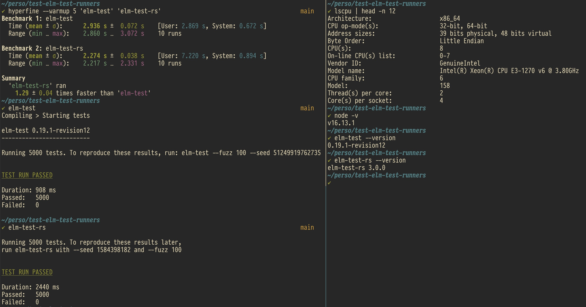

Test elm test runners with a large number of test files

5000 test files
1 test per file


# Usage

## elm-test

```shell
npm install --global elm-test
elm-test
```

## elm-test-rs

```shell
npm install --global elm-test-rs
elm-test-rs
```

# Results


